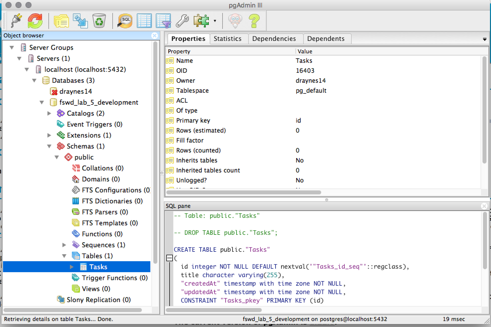

# Full Stack Web Development - Lab 5: All Your (Data)Base Are Belong To Us

You installed postgres, right? (`brew cask install postgres` and `brew
install postgresql`)

Now:

1. Fork the repository to your own Github account.
2. Clone your fork to your own machine.
3. Navigate to the clone on your machine and run `npm install`
4. Then run `npm run dev_db_create`

## Concepts for today

* **SQL** as a structured language for storing, retrieving and updating persistent data
* **ORM** (Object-Relational Mapping). A layer on top of the database that allows the programmer to more easily retrieve and manipulate the data contained in it.
* **CRUD**: Create, Read, Update, Delete. The four primary database operations.
* **Migrations**: Repeatable ways to alter your database structure and the data within it
* **Promises**: Asynchronous JavaScript

## Let's look at the database!

Now install [pgAdmin](http://pgadmin.org) by running `brew cask
install pgadmin3`. Then open it with `open
~/Applications/pgAdmin3.app`. In the `File` menu, select `Add
Server...`. Enter `localhost` for the name and host and click 'OK'.



# Exercises!

## Creating a migration

We want to add a column to the tasks table to track when a particular task was completed (and therefore also be able to tell *if* it was completed). To do that, create a new database migration with sequelize.

1. Open `migrations/20160228202524-create-task.js` and `models/task.js` in your text editor. This is the migration that creates the initial `Task` table using [`queryInterface.createTable`](http://docs.sequelizejs.com/en/latest/docs/migrations/#createtabletablename-attributes-options) and the model (the JavaScript side of the **ORM** layer) that was created at the same time.
2. Run `npm run sequelize -- help`
3. Run `npm run sequelize -- help:migration:create`
4. To create a migration, we need to give it a name. Run `npm run sequelize -- migration:create --name AddCreatedAtToTask`
5. The output from that command will include the migration file that was created (something like `migrations/20160525193115-AddCreatedAtToTask.js`). Open it up in your text editor.
6. Using the functions [`queryInterface.addColumn`](http://docs.sequelizejs.com/en/latest/docs/migrations/#addcolumntablename-attributename-datatypeoroptions-options) and [`queryInterface.removeColumn`](http://docs.sequelizejs.com/en/latest/docs/migrations/#removecolumntablename-attributename-options), update the migration to add/remove a `createdAt` column on the `Tasks` table. (Hint: don't forget to check out the [list of data types](http://docs.sequelizejs.com/en/latest/docs/models-definition/#data-types))
7. When you feel confident that your migration changes are correct, you can test your migration by running `npm run sequelize -- db:migrate`.
8. Refresh your view of the table and see your changes!

## Working with the **ORM**

1. Open `lib/app.js` in your text editor. Around line 36, you should see:
```javascript
var Task = require('../models').Task;
```
2. That is enough to get you access to the database.
3. Start by implementing the `/todo/new` route. It should expect a `POST` request, with a body that contains a `todo` property set to the value of the new `Task` to be created.

  To create a new Task in the database, the `Task` object has a `create` method. That method takes an object with the column name and value pairs (e.g., `{ title: 'Laundry' }`) and it returns a special object called a Promise.

  Anything that you want to execute *after* the function that returned the promise finished, you will need to attach to the promise with the `.then` function, which will be called with the value returned by the original function.

  ```javascript
  Task.create({ todo: 'Laundry'}).then(function(newTask) {
    // do a thing with newTask here
  })
  ```

  Make your handler for the `/todo/new` route display to the user the `id` and `title` properties of the task that was created.
4. Next implement `/todo/:task_id`. Use the `:task_id` parameter to load that particular task from the database and display the `id` and `title` properties to the user (just like `/todo/new`).

  To load a task from the database, if you already have the id, the `Task` object has a `findById` method that takes a single value, the id, and returns a promise that will eventually return the task that is loaded from the database.

  ```javascript
  Task.findById(1234).then(function(task1234) {
    // do something with task1234
  });
  ```
4. Finally, implement the `/todo` route. This route will need to display a list to the user of all the tasks in the database. Once again, `Task` has you covered: `findAll`. It returns a promise that returns an array of all the tasks.

  ```javascript
  Task.findAll().then(function(allTheTasks) {
    // do something with allTheTasks
  });
  ```

  Use a Jade template (if you haven't already been doing so) to display to the user all the tasks. Jade has a [built in iteration construct](http://jade-lang.com/reference/iteration/) to help with just this kind of situation.

  ```jade
  ul
    each val in someArray
      li= val
  ```

## Links

* [Sequelize DataTypes](http://docs.sequelizejs.com/en/latest/docs/models-definition/#data-types)
* [Sequelize Validations](http://docs.sequelizejs.com/en/latest/docs/models-definition/#validations)
* [Sequelize Hooks](http://docs.sequelizejs.com/en/latest/api/hooks/)
* [Sequelize Model methods](http://docs.sequelizejs.com/en/latest/docs/models-usage/)
* [Sequelize Querying](http://docs.sequelizejs.com/en/latest/docs/querying/)
